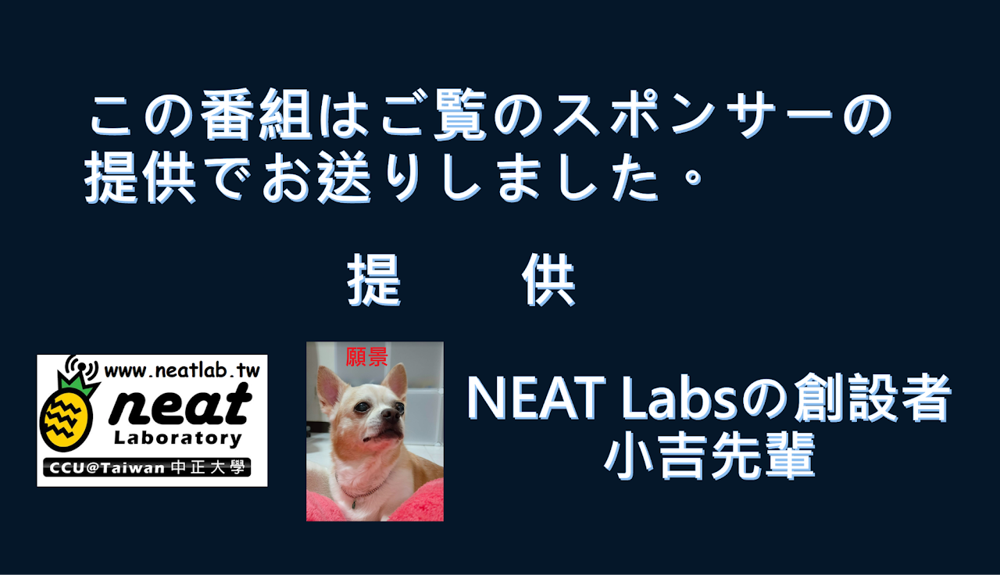
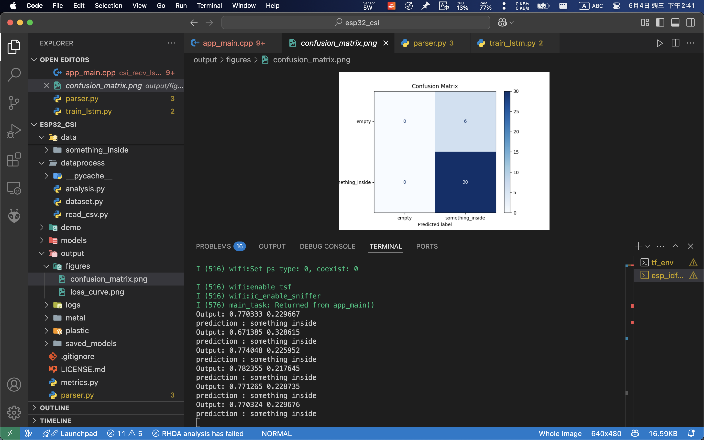
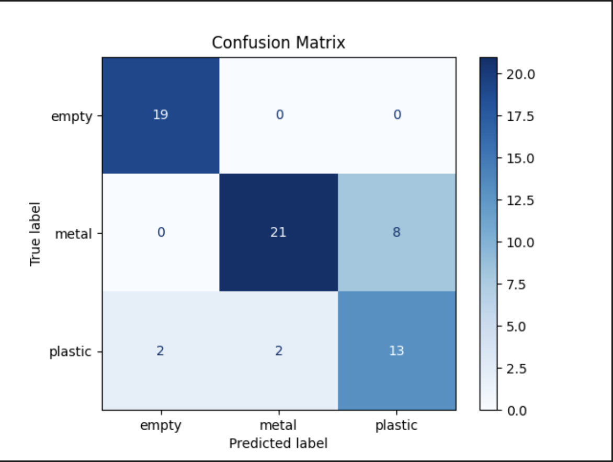
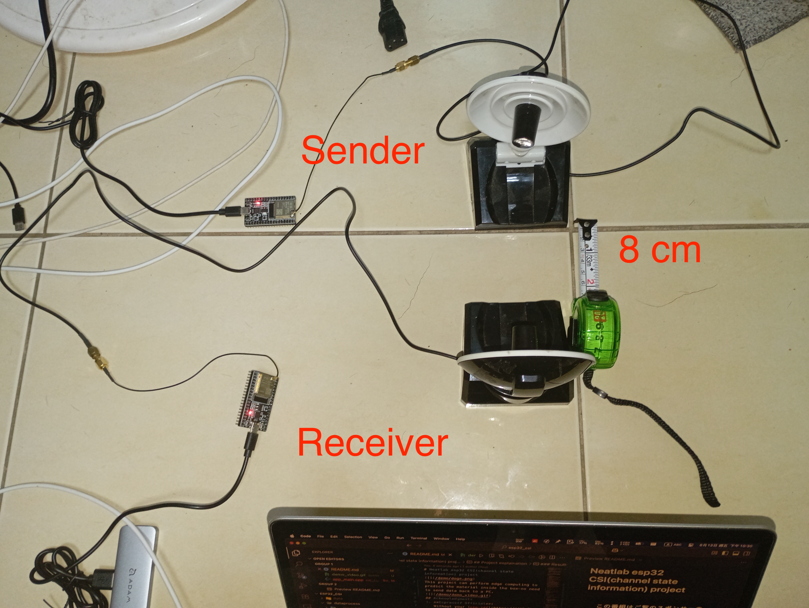
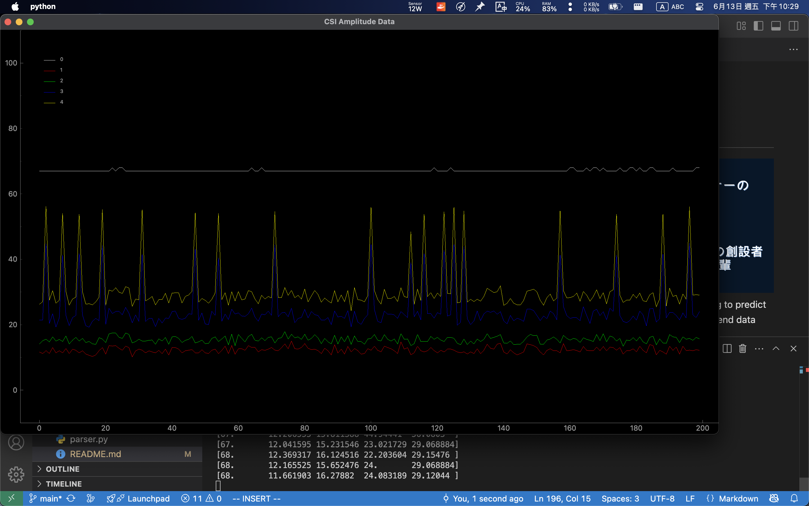
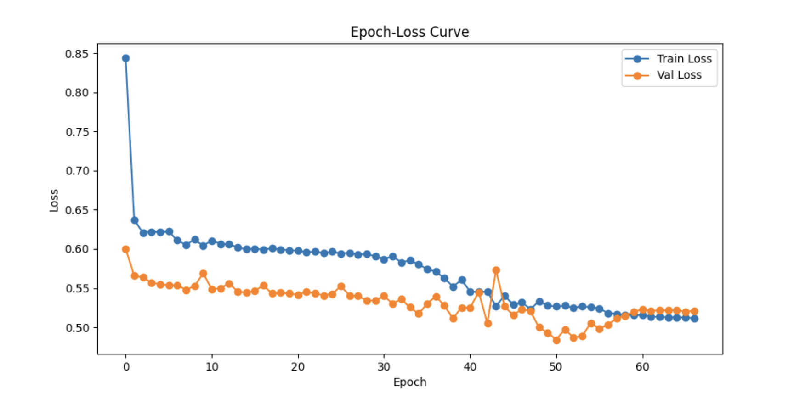
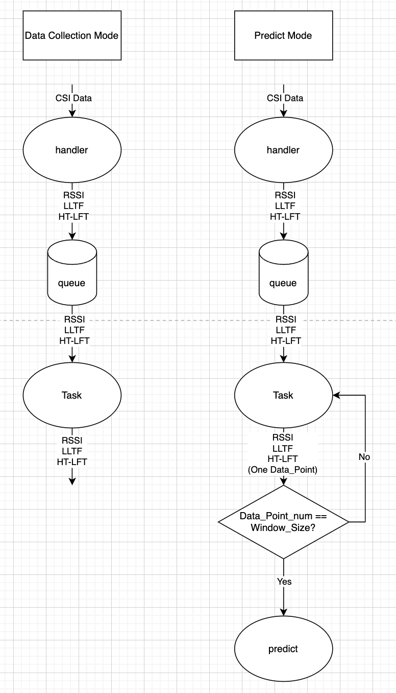
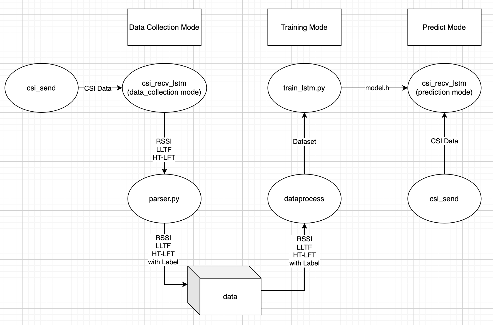

# Neatlab esp32 CSI(channel state information) project


This project can perform edge computing to predict the material inside the box—no need to send data back to a PC.
## Acknowledgments
1. **Espressif Official**: 
   Without your [esp-idf](https://github.com/espressif/esp-idf) and [esp-csi](https://github.com/espressif/esp-csi) examples, I wouldn’t even know where to start.

2. **Retsediv**: Thank you for your [WIFI_CSI_based_HAR](https://github.com/Retsediv/WIFI_CSI_based_HAR) project—your detailed documentation matched my needs perfectly.

## DONE and TODO
- [x] TX sends CSI to RX
- [x] Read and parse CSI info
- [x] Label data based on terminal input
- [x] Wrap all data into a dataset usable by a DataLoader
- [x] Load dataset into LSTM model for training
- [x] Optimize the project's code to improve readability.
- [x] Use argparse and logger for debugging 
- [x] Visualize loss curve and confusion matrix
- [x] Collect a large amount of experimental CSI data.
   > ⚠️**Notice**
   >> It can be considered as completing a part of the project, which can distinguish whether there are plastic bottles inside boxes or bags.
- [x] Send the trained model parameters to ESP32 with TinyML so that the ESP32 can perform prediction(edge computing). 
  > ⚠️**Notice**
  >> Starting from this task, I will use Keras to restructure the entire project for easier deployment of TinyML.
- [x] Test the model in practice and optimize it.

  > ⁉️**Warning**
  >> The system always predicts something inside the box—even when there’s nothing there.
  
  
  
  > ⚠️ **Notice**  
  >> maybe solved(not the best) :

  

## Get Started
Following operations are based on Macos.
### Hardware
- Two ESP32-32U modules
- Two antennas
- One Laptop


### Virtual Environment
- Miniconda

### Python Version
- 3.10.16(for tensorflow env)
- 3.13.2 (for esp_idf env)

### Setup Instructions
1. Clone the repository:
      ```bash
      git clone https://github.com/3epiossi/Neatlab.git
      cd esp32_csi
      ```

2. Set Up Tensorflow Environment
   Activate your Python virtual environment. This project uses Python 3.10.16 (Miniconda recommended):
      ```bash
      conda create -n tf_env python=3.10.16
      conda activate tf_env
      ```

3. Install Python Dependencies
      ```bash
      pip install -r requirements.txt
      ```

4. **Install ESP-IDF**
   Follow the [official ESP-IDF documentation](https://docs.espressif.com/projects/esp-idf/en/latest/esp32/get-started/) to install the latest version of **ESP-IDF** for your platform (macOS/Windows/Linux).

5. Create esp_idf env (recommand to open another terminal tab for convenience)
      ```bash
      conda create -n esp_idf_env python=3.13.2
      conda activate tf_env
      get_idf
      ```

6.  Build and flash the sender firmware
      ```bash
      cd csi_send
      idf.py set-target esp32
      idf.py build
      idf.py -p <PORT> [-b BAUD] flash
      ```
   
7. Build and flash the receiver firmware
      ```bash
      cd csi_recv_lstm
      idf.py set-target esp32
      idf.py build
      idf.py -p <PORT> [-b BAUD] flash
      ```

8. **Collect Data Points**
   
   Run the following command:
      ```bash
      python parser.py -p <PORT> -c <label_class_name>
      ```
   This will open a window displaying real-time CSI data visualization.
   Once you close the window, the program will terminate and one data point will be collected and saved.
   
9.  **Train the LSTM Model**
      ```bash
      python train_lstm.py
      ```
     This program will train LSTM model base on your data collected in step 7, and gives you Loss curve, Confusion matrix and tfModel.h as the result.

     

10. Move tfModel.h from `output/tfModel.h` to `csi_recv_lstm/main/tfModel.h`
    ```bash
    mv ./output/tfMode.h ./csi_recv_lstm/main/tfModel.h
    ```
11. Comment `#define DATA_COLLECTION_MODE` to switch mode. 
   * In csi_recv_lstm/main/app_main.cpp, 27th row.

12. Build and flash the receiver firmware
      ```bash
      cd csi_recv_lstm
      idf.py set-target esp32
      idf.py build
      idf.py -p <PORT> [-b BAUD] flash
      idf.py monitor -p <your port name>
      ```

13. Now, you may see the prediction in your terminal.
## License
This project is licensed under the GNU License – see the [LICENSE.md](https://github.com/3epiossi/Neatlab/blob/main/esp32_csi/LICENSE.md) file for details

## Project explaination
### The structure of this project:
```bash
.
├── .gitignore
├── csi_recv_lstm
│   ├── CMakeLists.txt
│   ├── dependencies.lock
│   ├── main
│   │   ├── app_main.cpp
│   │   ├── best_model
│   │   │   └── tfModel.h
│   │   ├── CMakeLists.txt
│   │   ├── idf_component.yml
│   │   └── tfModel.h
│   ├── README.md
│   ├── run.sh
│   ├── sdkconfig
│   ├── sdkconfig.defaults
│   └── sdkconfig.old
├── csi_send
│   ├── CMakeLists.txt
│   ├── dependencies.lock
│   ├── main
│   │   ├── app_main.c
│   │   ├── CMakeLists.txt
│   │   └── idf_component.yml
│   ├── README.md
│   ├── sdkconfig
│   ├── sdkconfig.defaults
│   └── sdkconfig.old
├── dataprocess
│   ├── dataset.py
│   └── read_csv.py
├── LICENSE.md
├── parser.py
├── README.md
├── requirements.txt
└── train_lstm.py
```
### File (or Folders) Simple Explanations
Here I will pick out a few important files (or folders) to explain their functions:
1. csi_send:
   * ESP32 CSI sending terminal's code required(Sends CSI Data 10 HZ frequency)
2. csi_recv_lstm:
   * The code of the esp32 csi receiving end is responsible for two tasks (not responsible at the same time).
      1. When the PC collects data, csi_recv_lstm will return the received data (data_collection mode).
      2. When using a PC-trained model to predict, csi_recv_lstm is responsible for actually performing the prediction and returning the prediction results to the PC (predict mode).
      3. The difference between the two can be seen using the following flowchart.
      
3. parser.py:
   * Analyze the data returned by csi_recv_lstm (data_collection mode).
   * Place the parsed data in data folder classified with label.
4. dataprocess:
   * Analyze and convert the data of the folder that has been classified.
   * Output dataset for training lstm.py
5. train_lstm.py：
   * Use dataset for training
   * The trained model will be placed in the output folder (the output folder will be automatically generated during the program running).

### Flowchart of This Project:


### Result:
1. 
2. 
3. [demo video](https://www.youoube.com/shorts/uEpaOsHhDUo)
